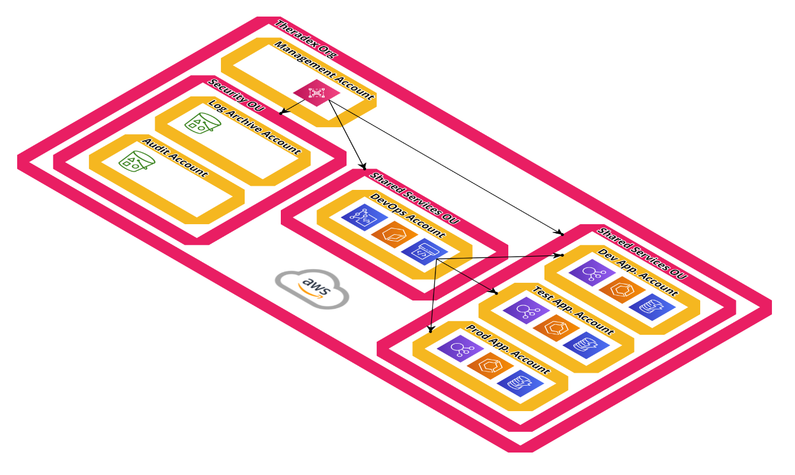
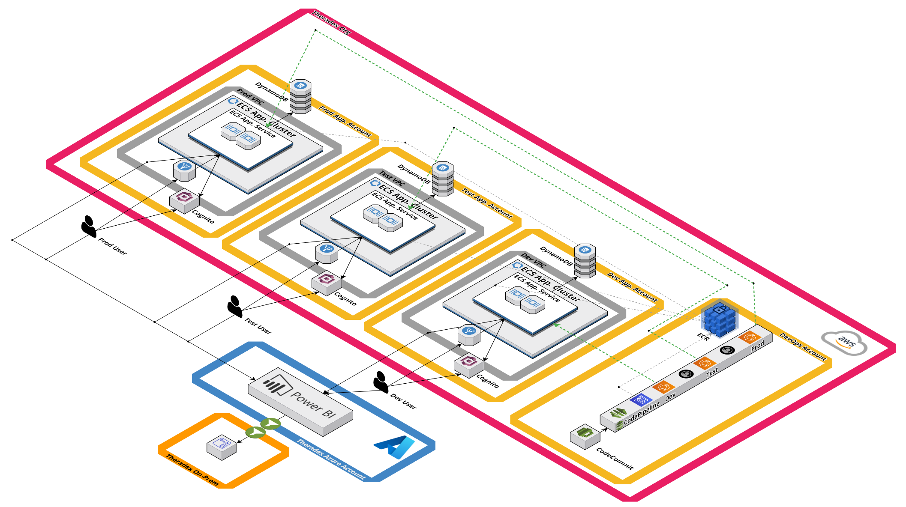

# AWS Architecture

Each environment is deployed to its own AWS account, with CI/CD pipelines in a shared services account. All infrastructure is managed by CDK and found in the [nci-web-reporting-infrastructure](https://github.com/Theradex/nci-web-reporting-infrastructure) GitHub repositoryt.

The following diagrams shows the architecture of the application in as AWS account:

