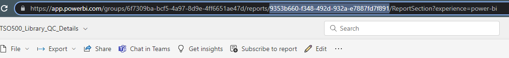
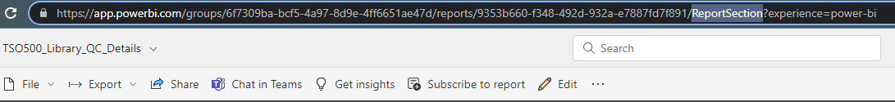
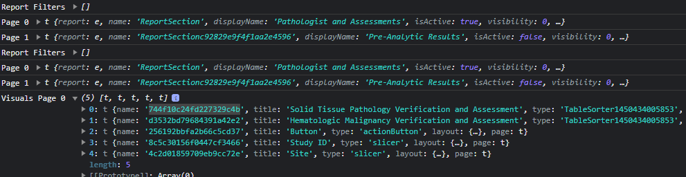

# NCI Theradex Oncology Reporting - PowerBI Embedding Inntegration

## PowerBI Embedded SDK
PowerBI embedding is using the Javascript SDK.  The SDK provides a set of functions that you can use to embed and control PowerBI reports [Microsoft docs](https://learn.microsoft.com/en-us/javascript/api/overview/powerbi/).

The library is included in the project in the `Pages/_Layout.cshtml` file and can be found in the `wwwroot/js` folder.

Samples of the SDK usage (and templates used for the custom report layouts) can be found in the [PowerBI Embedded Playgound](https://playground.powerbi.com/en-us/)

## PowerBI API
The PowerBI API is used for backend operations such as authentication and embed token generation. The C# library is included in the project as a NuGet package, and documentation can be found on [GitHub](https://github.com/MicrosoftPowerBI-CSharp).

Full API documentation can be found on [Microsoft docs](https://docs.microsoft.com/en-us/rest/api/power-bi/).

## Blazor JS Interop 
The Blazor JS Interop is used to call the PowerBI SDK functions from C# code. Documentation for Blazor's JS interop can be found on [Microsoft docs](https://learn.microsoft.com/en-us/aspnet/core/blazor/javascript-interoperability/?view=aspnetcore-6.0).

All JS SDK calls are wrapped in helper libraries in the `wwwroot/js` folder that contain all of the embedding logic needed for custom and full reports. These libraries are then called from the C# code.

- Full Report - `wwwroot/js/powerbi-embed-fullreport.js`
- Custom Layout Report - `wwwroot/js/powerbi-embed.js`

The helper libraries are also able to call C# functions from the JS code. This is used to notify the Blazor components when the report is loaded for UI management, error handling, etc. Details on how to call C# functions from JS can be found on [Microsoft docs](https://docs.microsoft.com/en-us/aspnet/core/blazor/call-dotnet-from-javascript?view=aspnetcore-6.0).

## Finding PowerBI Control IDs
The PowerBI control IDs are used to identify the report elements that need to be embedded. These IDs are not visible in the PowerBI report editor, but can be found in the URL of the report when editing it.

#### Report ID

#### Page Name

#### Visual Name
- Only needed for custom layout reports
- Visual Names are not visible in the report editor
- Visual metadata is logged to the Javascript console after embedding a custom report in the application
    - Slicers and other control elements are also considered visuals

